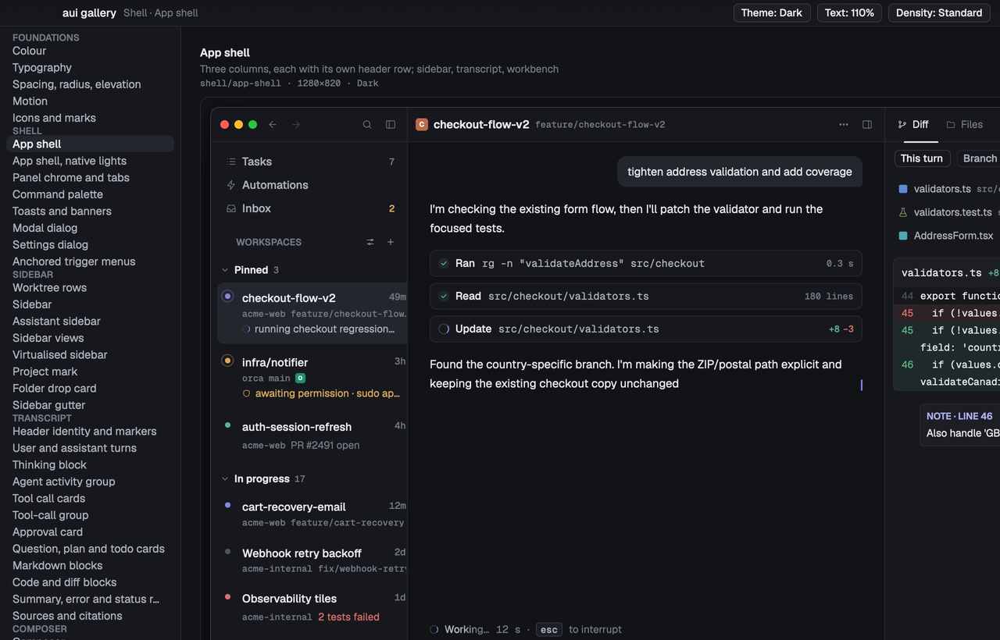

# agentic-ui (`aui`)

[](https://github.com/latekaapi/agentic-ui/actions/workflows/ci.yml)
[](LICENSE)

`aui` is a [gpui](https://www.gpui.rs) (`gpui-pre` + `gpui-kit`) component
library for building agentic chat apps on macOS: the shell, sidebar,
streaming transcript, composer and workbench (terminal, browser, diff, files)
an agent-facing app needs, plus the tokens and motion engine that keep them
all looking and moving like one product. Everything is designed first as
plain HTML/CSS in `design/`, rendered to reference screenshots, and then
matched pixel-for-pixel in Rust — see [Design is the source of
truth](#design-is-the-source-of-truth) below.



## Status

`aui` is at **v0.1, pre-1.0**. The API is used by one real app today (see
[Reference consumer](#reference-consumer)) but is not yet stable: expect
breaking changes between minor versions until 1.0. There is no published
crates.io release; consume it as a git or path dependency.

## Requirements

- **macOS 14 (Sonoma) or later** — the version the reference consumer
  targets (`LSMinimumSystemVersion`). `aui` itself sets no deployment target
  of its own; the shell, webview (`aui-webview`) and terminal (`aui-terminal`)
  panes are built on AppKit and WKWebView and are macOS-only.
- **Rust 1.85 or later** (the workspace uses async closures; `rust-version`
  is pinned in `Cargo.toml`).
- **Xcode command line tools**: `xcode-select --install`.

## Adding it to a project

Not published to crates.io yet — add it as a git dependency (pin a tag once
one exists; `main` until then):

```toml
[dependencies]
aui = { git = "https://github.com/latekaapi/agentic-ui", tag = "v0.1.0" }
aui-protocol = { git = "https://github.com/latekaapi/agentic-ui", tag = "v0.1.0" }
gpui = { package = "gpui-pre", version = "0.3.3" }
gpui-kit = "0.6"
```

`aui` re-exports the rest of the workspace, so most consumers only need
`aui` and `aui-protocol` directly; reach for `aui-webview` / `aui-terminal`
only if you want the browser or terminal panes. See [Getting
started](#getting-started) for the full walkthrough.

## Crates

| Crate | What it is |
| --- | --- |
| `aui-tokens` | Colour, space, radius, type, shadow and motion tokens; light and dark themes for the `gpui-kit` theme registry. |
| `aui-motion` | Springs and animation primitives: `Transition`, `Presence`, `Collapse`, `Stagger`, `Shimmer`, `IconMorph`, `StreamReveal` and friends. |
| `aui-icons` | Lucide-style icon set plus provider marks, file-type icons and status glyphs. |
| `aui` | The component library itself: shell, nav, transcript, composer, workbench, data, feedback and overlay modules. |
| `aui-protocol` | Transport-agnostic session model — `Session`, `Turn`, `Block`, streaming `Delta`s and the `Intent`s the UI emits back. No I/O, no gpui. |
| `aui-webview` | The embedded browser pane: wry/WKWebView, tabs, nav, JS bridge, element annotator and screenshot-to-chat. |
| `aui-terminal` | PTY-backed block terminal and the agent's TUI mode, rendered as a gpui element. |
| `aui-gallery` | Storybook app: every component in every state, a motion playground and a theme switcher; also the source of the design-system previews. |

One standalone consumer lives in the library itself:
[`crates/aui/examples/minimal.rs`](crates/aui/examples/minimal.rs) — a single
window on the three-pane shell with a live transcript, a docked composer, an
approval card and a streamed reply, under 400 commented lines.

## Getting started

[`docs/08-getting-started.md`](docs/08-getting-started.md) walks through adding
the crates to a project, the init sequence, the data-in / intents-out pattern,
theming, text scale, motion and the keyboard, with the minimal example above
as the running thread:

```sh
cargo run -p aui --example minimal
```

[`docs/06-api.md`](docs/06-api.md) is the generated public-API overview and
[`CHANGELOG.md`](CHANGELOG.md) records what shipped in each release.

## Reference consumer

[Harness](https://github.com/latekaapi/harness) (placeholder link) is a
macOS agent-development app built on `aui` and is this library's real-world
proving ground: everything in `aui` exists because that app needed it.
Reading its usage of the shell, transcript and workbench components is a
faster way to see idiomatic `aui` than the minimal example alone.

## Build and run

```sh
# the storybook — every component, every state; `screens/assistant` is the live assistant mock
cargo run -p aui-gallery

# render one gallery entry at its card size, for the parity loop
cargo run -p aui-gallery -- --screenshot <entry> <out.png>

# other gallery flags
cargo run -p aui-gallery -- --list                          # entry ids and sizes
cargo run -p aui-gallery -- --theme light --entry <id>      # open in a theme / on an entry
cargo run -p aui-gallery -- --screenshot-window <out.png>   # whole window, chrome included
cargo run -p aui-gallery -- --screenshot <entry> <out.png> --screenshot-delay 900   # sample motion later

# render, diff against the reference and print the pixel distance
scripts/parity.sh <entry> <reference-stem>     # e.g. scripts/parity.sh foundations/colour 01-color

# regenerate the gpui-kit theme JSON (crates/aui-tokens/themes/agentic-ui.json)
cargo run -p aui-tokens --example dump-theme

# tests across the workspace
cargo test --workspace

# API docs for every crate
cargo doc --workspace --no-deps --open
```

## Features

Everything is off by default; each one pulls real dependencies.

| Crate | Feature | What it turns on |
| --- | --- | --- |
| `aui` | `tree-sitter` | `transcript::syntax_runs` routes through gpui-kit's tree-sitter highlighter instead of the small built-in lexer (five grammar crates and their C sources). |
| `aui-webview` | `wry` | The real browser pane: a `wry` WKWebView child view parented to the gpui window, instead of the scripted `FakeWebBackend`. |
| `aui-terminal` | `pty` | A real pseudo-terminal running the login shell, instead of the scripted `FakePty`. |
| `aui-terminal` | `tui` | The alacritty grid model behind the agent's TUI pane. |

```sh
# everything the CI all-features job builds
cargo build --workspace --features aui-webview/wry,aui-terminal/pty,aui-terminal/tui
```

The traits, the zsh shell-integration snippet and the known limitations of the
two backend crates are in [`docs/07-backends.md`](docs/07-backends.md).

## Continuous integration

[`.github/workflows/ci.yml`](.github/workflows/ci.yml) runs on `macos-latest`:
the default build, the all-features build above, `cargo test --workspace`,
`cargo clippy --workspace -- -D warnings` and `cargo doc --workspace --no-deps`
with `RUSTDOCFLAGS=-D warnings`. The workspace's minimum supported Rust version
is 1.85 (async closures).

## Design is the source of truth

- `design/` holds the design system: `design/src/cards/**` are the authored
  cards, `design/dist/` the built HTML, `design/tokens/` the token JSON, and
  `design/reference/` the rendered PNGs that Rust output is compared against.
- `docs/02-component-spec.md` is the component contract — every card, every
  state, every measurement.
- `docs/03-parity-process.md` is the render-and-compare loop.
- `docs/04-design-rules.md` is the taste guide the specs are written against.

When the design and the code disagree, the design wins; change the card first,
re-render the reference, then change the Rust.

## The parity loop

For each component: read its section of the spec, build it in `aui`, add a
gallery entry covering every state, render it with
`cargo run -p aui-gallery -- --screenshot <entry> <out.png>`, and compare the
result against the matching PNG in `design/reference/`. Differences in spacing,
weight, colour or motion are bugs in the Rust until the spec says otherwise. The
full procedure, including how to add a new reference render and what counts as a
pass, is in [`docs/03-parity-process.md`](docs/03-parity-process.md).

## License

MIT — see [`LICENSE`](LICENSE). The bundled Geist / Geist Mono fonts
(`crates/aui-tokens/fonts/*.ttf`) ship under the SIL Open Font License 1.1
(`crates/aui-tokens/fonts/OFL.txt`), and the icon set adapts glyphs from
Lucide (ISC). See [`THIRD-PARTY-NOTICES.md`](THIRD-PARTY-NOTICES.md) for the
full third-party attributions.
