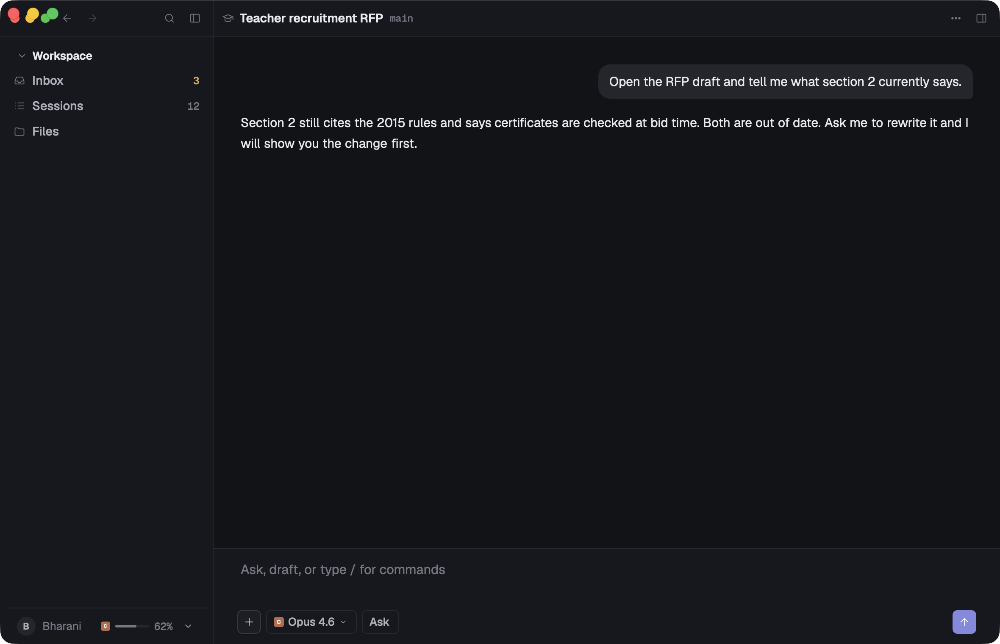
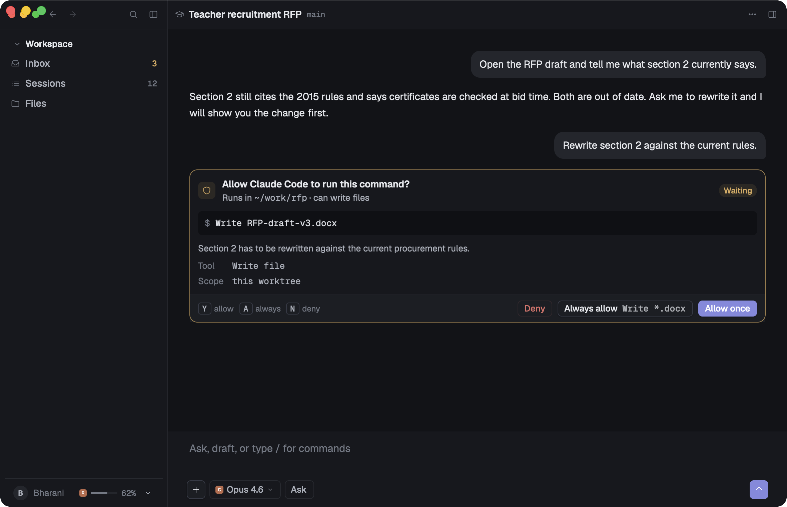

# Getting started

Build an agent app on `aui` in one file. The running thread of this guide is
[`crates/aui/examples/minimal.rs`](../crates/aui/examples/minimal.rs) — under
400 lines, heavily commented, and runnable right now:

```sh
cargo run -p aui --example minimal
```

It opens one window with the three-pane shell: a sidebar with a few nav rows, a
transcript in the centre, a docked composer under it, and the right pane closed.
Type something, press the send button, and the app appends your turn, raises one
approval card, and — once you answer it with `Y`, `A`, `N` or a click — streams a
canned reply back through the same `Delta` path a real backend would use.





Everything below is a section of that file.

---

## 1. Add the crates

The library is a Cargo workspace of six published crates plus a gallery. A
consumer needs three of them at minimum:

```toml
[dependencies]
aui = { path = "…/agentic-ui/crates/aui" }        # the components
aui-protocol = { path = "…/agentic-ui/crates/aui-protocol" }  # the session model
gpui = { package = "gpui-pre", version = "0.3.3" }
gpui-kit = "0.6"
```

`aui` re-exports the rest, so you rarely name them directly:
`aui::tokens` (`aui-tokens`), `aui::motion` (`aui-motion`),
`aui::icons` (`aui-icons`) and `aui::protocol` (`aui-protocol`).

| crate | what you reach for it |
| --- | --- |
| `aui` | every component: `shell`, `nav`, `transcript`, `composer`, `workbench`, `data`, `feedback`, `overlay`, plus `keys`, `assets` and `util` |
| `aui-protocol` | `Session`, `Turn`, `Block`, `Delta`, `Intent` — pure data, no gpui, no I/O |
| `aui-tokens` | the palette, `scale::*`, `AuiStyled`, `AuiTheme`, `Density` |
| `aui-motion` | `spring`, `presence`, `stream_reveal`, `tint_fade`, `collapse`, … |
| `aui-icons` | `IconName`, `icon()`, provider marks, file-type glyphs |
| `aui-webview`, `aui-terminal` | the browser and terminal panes; see [`docs/07-backends.md`](07-backends.md) |

Prerequisites: macOS, Xcode command line tools, Rust stable. The full API
surface is listed in [`docs/06-api.md`](06-api.md).

## 2. The init sequence

Order matters, and it is one call plus its wrapper:

```rust
fn main() {
    // 1. The asset source: `aui-icons` layered over gpui-kit's Lucide set.
    gpui_kit::application().with_assets(aui::assets::AuiAssets).run(|cx| {
        // 2. gpui_kit::init → bundled fonts → theme registry → keymap.
        aui::init(aui::tokens::ThemeKind::Dark, cx);
        // 3. Optional: the product text scale.
        aui_tokens::AuiTheme::set_text_scale(aui_tokens::scale::TEXT_SCALE, None, cx);
        // 4. Now, and only now, open a window.
        cx.open_window(options, |window, cx| {
            let view = cx.new(|cx| MinimalApp::new(window, cx));
            cx.new(|cx| gpui_kit::component::Root::new(view, window, cx))
        })
        .expect("open window");
        cx.activate(true);
    });
}
```

Three things are easy to get wrong:

- **`with_assets` before anything else.** Without `AuiAssets` every icon renders
  as a blank box; `aui-icons` serves the design's own glyphs and falls through to
  gpui-kit for the rest.
- **`aui::init` before any window.** It calls `gpui_kit::init`, loads the bundled
  Geist / Geist Mono / Georgia faces, registers the light and dark themes with
  the gpui-kit theme registry, and binds the keymap in [`aui::keys`]. Calling it
  twice is harmless; calling it late is not.
- **`gpui_kit::component::Root` as the window root.** Overlays — popovers, the
  command palette, menus, toasts — are painted through it. A window without a
  `Root` renders the shell fine and then silently drops every overlay.

`TitleBar::window_options()` gives you the frameless window the shell's own
header and traffic lights are drawn against.

## 3. Data in, intents out

This is the whole architecture. The app owns state; components are stateless
`RenderOnce` values that read it and hand intents back through closures. No
component holds state, reaches into your app, or does I/O.

The state is an `aui_protocol::Session`:

```rust
struct MinimalApp {
    session: Session,               // the transcript, pure data
    composer: Entity<TextareaState>,// gpui-kit's text buffer
    sidebar_open: bool,
    right_open: bool,
    // …focus handles and the tasks that keep timers alive
}
```

A `Session` is `id`, `agent`, `model`, `mode`, `cwd`, `branch`, `environment` and
an ordered `Vec<Turn>`. A `Turn` is either `Turn::User { text, attachments,
mentions }` or `Turn::Assistant { blocks, meta }`, and every card in the
transcript is one `Block` variant — `Text`, `Thinking`, `Activity`, `ToolCall`,
`Approval`, `Question`, `Plan`, `Todo`, `Code`, `Diff` and the rest.

Rendering walks that data and picks a component per variant:

```rust
match block {
    Block::Text { text, streaming } => cited_answer(id, text.clone(), style).streaming(*streaming),
    Block::Approval { tool, command, state, .. } => approval_card(id, tool.clone(), command.clone(), state.clone())
        .on_decide(move |decision, w, cx| decide(&decision, w, cx)),
    // …activity_group, tool_card, question_card, code_block, …
}
```

Intents come back the other way. Every component that can be acted on takes an
`on_*` closure; in a gpui view you wrap it with `cx.listener` so it lands in a
method on your app:

```rust
composer("composer", &self.composer, Provider::Claude, "Opus 4.6")
    .docked(true)
    .streaming(self.streaming())
    .on_intent(move |intent, w, cx| handler(&intent, w, cx));
```

`ComposerIntent::Send` calls `MinimalApp::send`, which appends the user turn.
`ApprovalDecision::{Once, Always, Deny}` calls `MinimalApp::decide`. Nothing
else in the tree knows those methods exist.

### Streaming with `Delta`

Live updates are `aui_protocol::Delta`s folded in with `Session::apply`. The
example's "backend" is a timer loop, but the shape is exactly what a socket or a
child process would emit:

| delta | what it does |
| --- | --- |
| `TurnStarted { turn }` | appends a turn |
| `BlockAdded { turn_id, block }` | appends a card to a turn |
| `TextDelta { turn_id, block_index, text }` | appends a chunk to a `Block::Text` |
| `BlockUpdated { turn_id, block_index, block }` | replaces a card in place — how an approval goes from pending to resolved |
| `TurnFinished { turn_id, meta }` | clears every `streaming` flag and settles the footer meta |

`apply` ignores deltas that name a turn or block that no longer exists, so a
late delta from a cancelled turn cannot corrupt the session. Cancellation in the
example is one line — bump a run counter, and the task drops its own writes:

```rust
if this.run != run { return false; }
```

## 4. Theming

Never write a colour, size, radius or duration into a component. Read them:

```rust
let p = cx.aui().colors;                 // the active palette
div().bg(p.surface_1).border_color(p.line).text_color(p.ink)
     .rounded(px(scale::R_LG))            // radius token
     .p(px(scale::SP_6))                  // spacing token
     .ui(scale::FS_12)                    // 12 px UI type
```

`cx.aui()` is `aui_tokens::ActiveAui`, and it also carries `metrics` (row and
control heights for the active density) and `text_scale`.

Both themes have to be right. The palette is the same set of names in each, so
code written against `p.ink_3` / `p.surface_2` / `p.accent_soft` flips correctly
on its own — but look at both. Switch at runtime with:

```rust
AuiTheme::set_kind(ThemeKind::Light, Some(window), cx);
AuiTheme::toggle_kind(Some(window), cx);
AuiTheme::set_density(Density::Compact, Some(window), cx);
```

For type, `AuiStyled` gives you `text_role(TextRole::Title)`, `ui(size)`,
`mono(size)`, `text_px(size)`, `medium()` and `semibold()`. Prefer `text_role`
for the named roles and `ui` / `mono` for a specific step of the scale.

## 5. Text scale

The design is drawn at a 13 px base. The product ships at `scale::TEXT_SCALE`
(1.1); parity renders run at 1.0. Set it once at start-up, or whenever the person
changes it:

```rust
AuiTheme::set_text_scale(1.1, Some(window), cx); // clamped to 0.8 – 1.5
```

It scales type only — spacing, control heights and icon sizes stay put — so a
layout that reads well at 1.0 stays readable at 1.5. That is why component code
uses `ui(...)` / `mono(...)` rather than a raw `text_size`: those go through the
scale, a raw size does not.

## 6. Motion

Motion goes through `aui-motion` and nowhere else. It is sampled per frame from
the element that needs it, so a stateless component can still animate:

```rust
// each newly arrived block fades in and rises 3 px
let reveal = stream_reveal(id.clone(), index, settled, window, cx);
div().relative().top(reveal.offset_y).opacity(reveal.opacity).child(body)
```

The vocabulary: `spring` / `spring_px` for physical movement, `presence` for
enter and exit, `collapse` for height, `tint_fade` for hover tints,
`stream_reveal` for arriving content, `stagger_delay`, `shimmer_text`,
`number_ticker`, `icon_morph`, `pulse_ring`, `check_draw`.

Two rules worth stating outright. Never tween a colour to `transparent_black()` —
it fades through black; use `tint_fade`, which fades alpha. And anything that
overflows its own box (popovers, menus, fanned toast stacks) must go through
`aui::overlay::popover_layer`, or a later sibling paints over it.

`AuiTheme::reduce_motion(cx)` reports the system setting; the primitives already
honour it.

## 7. Keyboard

Components never read raw keystrokes. They declare a **key context** on the
element that owns a piece of behaviour and handle **actions**; `aui::init` binds
the keys once.

| keys | action | context |
| --- | --- | --- |
| `cmd-b` / `cmd-k` / `cmd-\` | `ToggleSidebar` / `TogglePalette` / `ToggleRightPane` | anywhere |
| `up` / `down` / `enter` | `SelectPrev` / `SelectNext` / `Confirm` | `MENU_CONTEXT` |
| `y` / `a` / `n` | `ApproveOnce` / `ApproveAlways` / `Deny` | `APPROVAL_CONTEXT` |
| `escape` | `Cancel` | `MENU_CONTEXT`, `APPROVAL_CONTEXT`, `ROOT_CONTEXT` |
| `tab` / `shift-tab` | `FocusNext` / `FocusPrev` | `ROOT_CONTEXT` |

Your root element wears `ROOT_CONTEXT`; the overlay or card that currently owns
the keyboard wears its own. In the example the pending approval card does this
and nothing else does, so `y` reaches exactly one handler:

```rust
if *state == ApprovalState::Pending {
    holder = holder
        .key_context(aui::keys::APPROVAL_CONTEXT)
        .track_focus(&self.focus_approval)
        .on_action(cx.listener(|this, _: &ApproveOnce, w, cx| this.decide(ApprovalDecision::Once, w, cx)))
        .on_action(cx.listener(|this, _: &ApproveAlways, w, cx| this.decide(ApprovalDecision::Always, w, cx)))
        .on_action(cx.listener(|this, _: &DenyAction, w, cx| this.decide(ApprovalDecision::Deny, w, cx)));
}
```

Focus itself moves through a `Window`, which an async task does not hold, so
park the request on your state and apply it in `render`:

```rust
if std::mem::take(&mut self.focus_pending_approval) {
    window.focus(&self.focus_approval, cx);
}
```

### The focus ring

gpui has no `:focus-visible`, so the library keeps one window-wide flag: any key
press arms it, any mouse press disarms it, and `data::Button` draws its accent
ring only while it is armed. `aui::shell::app_shell` installs that watcher on its
own root, so an app on the shell gets it free. An app that lays out its own root
calls the helper:

```rust
aui::keys::track_pointer(div().key_context(aui::keys::ROOT_CONTEXT).size_full())
```

`Tab` and `Shift-Tab` are yours to handle, because only you know your tab order.
Arm the flag when you move focus with the keyboard:

```rust
.on_action(|_: &FocusNext, window, cx| { aui::keys::set_keyboard_nav(true, cx); window.focus_next(cx); })
```

## Where to go next

- [`docs/06-api.md`](06-api.md) — every public item, per crate and module.
- [`docs/02-component-spec.md`](02-component-spec.md) — the component contract:
  every card, every state, every measurement.
- [`docs/04-design-rules.md`](04-design-rules.md) — the taste guide.
- [`docs/07-backends.md`](07-backends.md) — the webview and terminal panes.
- [`docs/03-parity-process.md`](03-parity-process.md) — how a component is
  checked against its design reference.
- `cargo run -p aui-gallery` — every component in every state, live.
